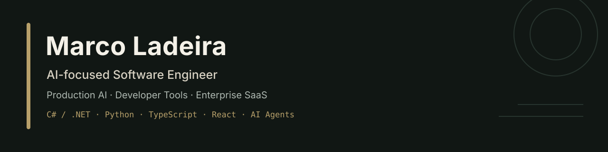

## I build AI systems that remain understandable after the demo

I am an AI-focused full-stack Software Engineer at **Fenergo**, working across production AI/LLM applications, enterprise SaaS, workflow automation and financial-services technology.

My strongest work sits where **AI engineering, backend reliability, product judgement and developer experience** meet. I enjoy taking ambiguous problems from discovery and architecture through implementation, testing, UX and release verification.

## Evidence at a glance

| Signal | Evidence |
| --- | --- |
| **Production AI delivery** | Co-built and shipped a beta production AI application from scratch as one of three engineers. |
| **Real-world adoption** | Helped deliver the application to hundreds of real users and testers. |
| **Professional performance** | Earned an **Exceeding** year-end rating, the highest performance outcome in the review cycle. |
| **Enterprise experience** | Build software across AI/LLM workflows, CLM, KYC/AML and enterprise workflow automation. |
| **End-to-end ownership** | Design and build independent products across architecture, code, testing, documentation, UX and release planning. |

## Featured engineering work

| Project | What it solves | Engineering signals |
| --- | --- | --- |
| **opAI** · Private product | A local-first AI coding cost firewall and cross-platform development workspace that helps developers control model usage, understand agent activity and reduce unnecessary AI spend. | Model routing, shared GUI/CLI architecture, streaming execution, cost accounting, cancellable runs, repository safety, GitHub automation, isolated worktrees and evidence-based verification. |
| **QuotePack** · Private commercial product | A product platform that helps small Irish trade businesses create clearer, faster and more profitable quotes without heavyweight job-management software. | Next.js, deterministic calculators, formula QA, accessibility contracts, privacy-aware browser tools, product governance and evidence-led growth. |
| **[NASA Space Explorer](https://github.com/MarcoLadeira/NasaAPI)** · Public | A responsive full-stack application for exploring multiple NASA open-data services. | React, TypeScript, Node.js, Express, typed API boundaries, React Query, backend route tests, security middleware, Docker and Railway deployment. |
| **[Personal Finance Dashboard](https://github.com/MarcoLadeira/Personal-Finance-Dashboard-with-Predictive-Analytics)** · Public | An ASP.NET Core MVC dashboard for users, wallets, transactions, notifications, income, expenses and net balance. | C#, .NET 8, MVC, EF Core domain modelling, migrations, SQL Server, service layers, Razor views and verified build instructions. |

**[Read the extended project case studies →](./PROJECTS.md)**

## Technical focus

| Area | Technologies and capabilities |
| --- | --- |
| **AI and agent systems** | LLM integrations, AI agents, tool calling, model routing, context management, MCP workflows, prompt engineering, safety controls, evaluation and cost optimisation. |
| **Backend and platform** | C#, .NET, ASP.NET Core, Python, Node.js, Express, REST APIs, Entity Framework Core, SQL Server, service architecture and workflow automation. |
| **Frontend and product** | TypeScript, React, Next.js, JavaScript, HTML/CSS, responsive UX, desktop applications, accessibility and product-focused implementation. |
| **Engineering delivery** | Git, GitHub, pull requests, code review, automated testing, CI/CD, Docker, debugging, technical documentation and release verification. |

  
  
  
  
  
  
  
  

## How I engineer

- **Start with the real problem.** Define the user, constraints, risks and measurable outcome before choosing the implementation.
- **Make agent behaviour observable.** AI output is not proof; commands, diffs, tests, logs and evidence should remain inspectable.
- **Keep boundaries clear.** Separate product logic, infrastructure and presentation so systems remain understandable and testable.
- **Design for failure.** Cancellation, recovery, permissions, privacy and safe defaults are product features—not cleanup work.
- **Ship evidence, not confidence.** Prefer verified builds, tests and explicit limitations over unsupported claims.

## Current direction

- Building and hardening **opAI** toward an alpha release.
- Developing **QuotePack** as a focused commercial product platform.
- Shipping reliable AI and enterprise software at **Fenergo**.
- Deepening my work in applied AI, agentic systems, developer tooling and trustworthy software automation.

### Build useful systems. Make the work visible. Verify the result.

[Portfolio](https://marcoladeira.github.io/MarcoLadeiraWebsite/) · [LinkedIn](https://www.linkedin.com/in/marco-ladeira/) · [Email](mailto:marcoladeiraworkemail@gmail.com) · [Project case studies](./PROJECTS.md)

